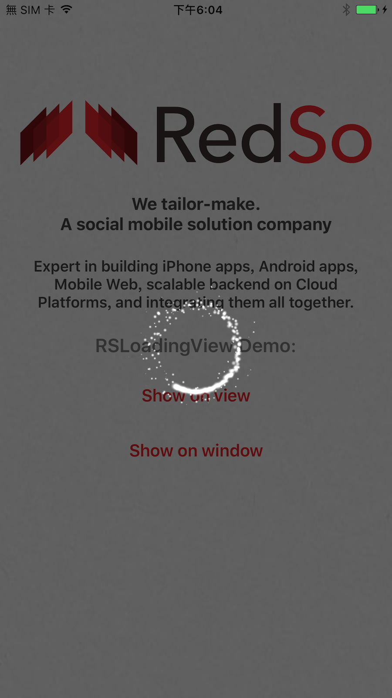
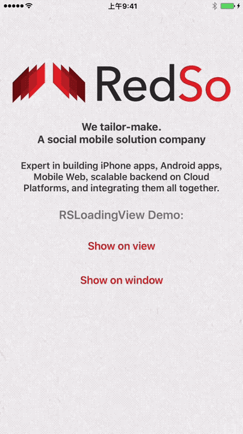

# RSLoadingView

## Introduction

`RSLoadingView` bring your app to the new age of loading animations using 3D engine.
- Written with Swift
- Customizable
- Using Apple's SceneKit with OpenGL
- Include HUB feature: show full screen loading HUB with one line of code
- Or use as standalone view
- Configurable in interface builder

## Requirements
- Swift 4.0
- iOS 9+

## Demo
SpinAlone - `base` Variant



SpinAlone - `base` Variant



SpinAlone - `inAndOut` Variant; speedFactor = 2.0; lifeSpanFactor = 2.0; mainColor = UIColor.red


Twins - `base` Variant


## Installation
RSLoadingView is available through [CocoaPods](http://cocoapods.org). To install
it, simply add the following line to your Podfile:

```ruby
pod "RSLoadingView"
```

## Usage
```swift
import UIKit
import RSLoadingView

class ViewController: UIViewController {

  @IBAction func showLoadingHub() {
    let loadingView = RSLoadingView()
    loadingView.show(on: view)
  }

  @IBAction func showOnViewTwins() {
    let loadingView = RSLoadingView(effectType: RSLoadingView.Effect.twins)
    loadingView.show(on: view)
  }

  func hideLoadingHub() {
    RSLoadingView.hide(from: view)
  }

  @IBAction func showOnWindow() {
    let loadingView = RSLoadingView()
    loadingView.showOnKeyWindow()
  }

  func hideLoadingHubFromKeyWindow() {
    RSLoadingView.hideFromKeyWindow()
  }
  
}

```

## Supported Effect
| Effect | Variants |
| ------ | ------ |
| RSLoadingSpinAlone | base, inAndOut |
| RSLoadingTwins | base |
| RSLoadingTriples | (coming soon) |

## Customization
##### Loading View Related
| Field | Default Value |
| ------ | ------ |
| speedFactor | 1.0 |
| mainColor | UIColor.white |
| colorVariation | 0.0 |
| sizeFactor | 1.0 |
| spreadingFactor | 1.0 |
| lifeSpanFactor | 1.0 |
| variantKey | "" |
##### HUB Related
| Field | Default Value |
| ------ | ------ |
| shouldDimBackground | true |
| dimBackgroundColor | UIColor.black.withAlphaComponent(0.6) |
| isBlocking | true |
| shouldTapToDismiss | false |
| sizeInContainer | CGSize(width: 180, height: 180) |

## Author

Roy Ng, roytornado@gmail.com
@ Redso, https://www.redso.com.hk/

Linkedin: https://www.linkedin.com/in/roy-ng-19427735/

## License

RSLoadingView is available under the MIT license. See the LICENSE file for more info.

